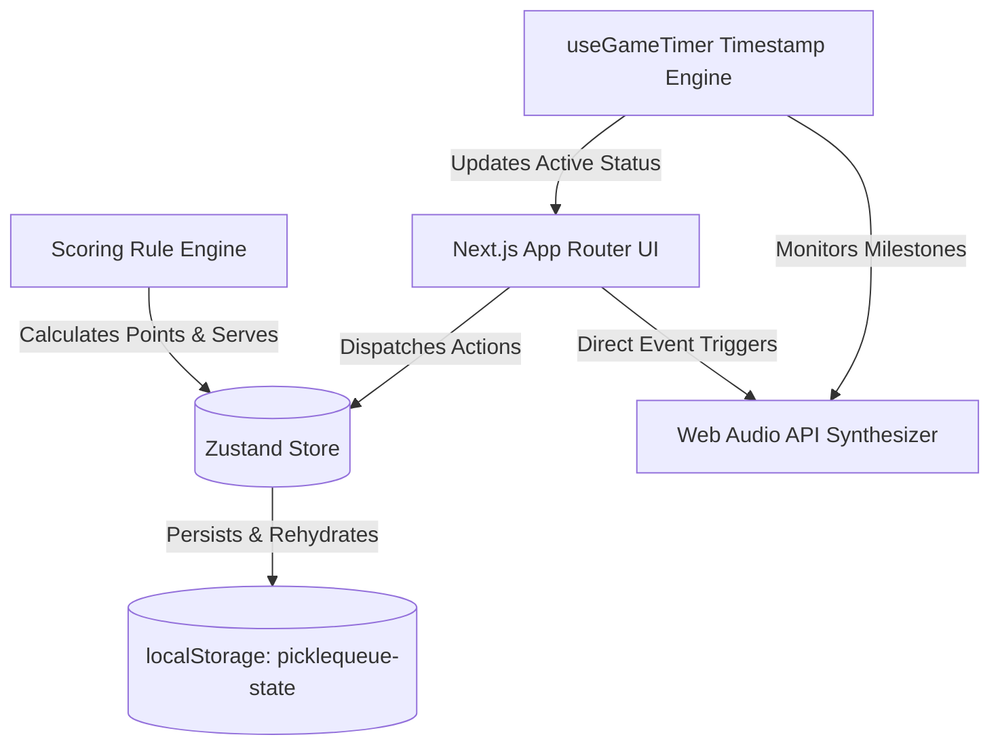
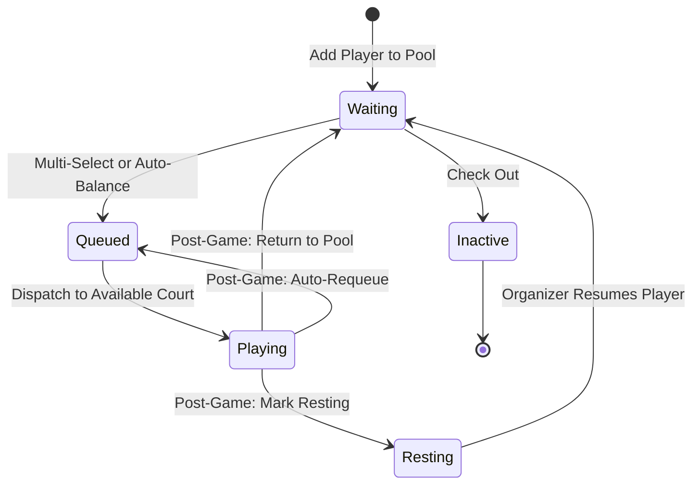

# PICKLEQUEUE

**Modern Pickleball Court Queuing, Rotation & Operations Dashboard**

[](https://github.com/dev-reymark/picklequeue/actions/workflows/ci.yml)
[](https://github.com/dev-reymark/picklequeue/releases)
[](LICENSE)

PICKLEQUEUE is a venue-first operations console designed for pickleball venues, open-play rotations, and tournament organizers. It handles player registration, 2v2 doubles skill balancing, FIFO court queues, drift-free match countdown timers, configurable game scoring engines, and event-based venue sound notifications.

---

## Live Deployment

- **Interactive Web App**: [https://picklequeue-ten.vercel.app/](https://picklequeue-ten.vercel.app/)

---

## Core Features

- **Venue-Centric Console**: 70% court overview visible across the facility, paired with a dedicated queue sidebar and docked waiting pool drawer.
- **Drift-Free Timers**: Timers use absolute system timestamps (`endsAt - Date.now()`) to prevent timing drift across page refreshes, tab switching, or device sleep.
- **Configurable Scoring Engine**: Supports Side-Out (traditional 3-digit pickleball scoring: Server 1 / Server 2), Rally scoring, and Manual scoring modes with custom target scores, win-by margins, and serve indicators.
- **Procedural Sound Suite**: Web Audio API synthesizer with zero external MP3 downloads, milestone alert guards (2-minute warning, 30-second warning, time up), and venue sound profiles (`Minimal`, `Standard`, `Silent`).
- **Matchmaking & Auto-Balance**: Computes optimal 2v2 team permutations from waiting players to balance skill ratings and display match quality scores.
- **Post-Match Rotation Engine**: Workflows to Return to Waiting Pool, Requeue, Mark as Resting, or Check Out.
- **Component-Driven UI System**: Type-safe primitive components under `src/components/ui/` with consistent cursor states and focus rings.
- **Strictly Zero Emojis**: High-contrast, clean typography and semantic status dots instead of playful emojis.
- **Local Persistence & Backup**: Persistent state in `localStorage` (`picklequeue-state`) with full JSON backup export and import.
- **Light, Dark, and System Themes**: High-contrast themes powered by `next-themes` with a subtle light mode pin-dot grid.

---

## Tech Stack

- **Framework**: Next.js 16 (App Router, Turbopack)
- **Language**: TypeScript 5 (Strict Mode)
- **Styling**: Tailwind CSS v4, custom CSS variables, and dot-matrix background pattern
- **State Management**: Zustand 5 with `persist` middleware
- **Theming**: `next-themes` (Light / Dark / System)
- **Audio Engine**: Web Audio API (Procedural Oscillators & Envelopes)
- **Icons**: Lucide React (Minimal, functional set)
- **Mascot**: `page-mascot` (interactive welcome banner)

---

## Getting Started

### Prerequisites
- Node.js 18.18 or later
- npm or yarn

### Installation
```bash
git clone https://github.com/dev-reymark/picklequeue.git
cd picklequeue
npm install
```

### Running the Development Server
```bash
npm run dev
```
Open [http://localhost:3000](http://localhost:3000) in your web browser.

### Building for Production
```bash
npm run build
npm run start
```

---

## Project Structure

```text
picklequeue/
├── .github/
│   ├── ISSUE_TEMPLATE/          # Bug report & feature request templates
│   ├── pull_request_template.md
│   └── workflows/
│       └── ci.yml               # GitHub Actions CI build & typecheck
├── public/
│   ├── avatars/                 # Player avatar SVGs/PNGs
│   ├── mascots/                 # Interactive mascot sprites
│   ├── favicon.ico
│   └── logo.svg
├── src/
│   ├── app/
│   │   ├── globals.css          # Global styles, cursor rules, pin-dot grid
│   │   ├── layout.tsx           # Root layout with ThemeProvider
│   │   └── page.tsx             # Main operational dashboard
│   ├── components/
│   │   ├── courts/              # Court cards, grids, and court timers
│   │   ├── layout/              # Header, metrics bar, and theme controls
│   │   ├── players/             # Waiting pool drawer and player check-in
│   │   ├── providers/           # App-level context & theme providers
│   │   ├── queue/               # FIFO & balanced queue panels and reorder controls
│   │   ├── scoring/             # Scoreboard, live controls, serve indicators, result modals
│   │   ├── session/             # End session modal and metrics summary
│   │   ├── settings/            # Multi-tab operational settings console
│   │   ├── tutorial/            # 5-step spotlight onboarding tour
│   │   └── ui/                  # Reusable UI design system (Button, Modal, Card, Badge, etc.)
│   ├── hooks/
│   │   ├── use-game-timer.ts    # Drift-free countdown and milestone triggers
│   │   └── useSound.ts          # Centralized audio hook with profile filtering
│   ├── lib/
│   │   ├── scoring/             # Scoring engines (Side-Out, Rally, Manual, Winner resolution)
│   │   ├── avatar.ts            # Avatar helpers and asset mappings
│   │   ├── demo-data.ts         # Sample players and courts for quick testing
│   │   ├── matchmaking.ts       # 2v2 skill balancing and team permutation algorithm
│   │   ├── sound.ts             # Web Audio API procedural synthesizer
│   │   └── utils.ts             # Utility helpers
│   ├── store/
│   │   └── pickleball-store.ts  # Zustand persistent state store
│   └── types/
│       └── index.ts             # TypeScript interfaces and domain models
├── CHANGELOG.md                 # Semantic release notes
├── CONTRIBUTING.md              # Contribution guidelines
├── LICENSE                      # MIT License
└── package.json
```

---

## Technical Architecture

### System Overview

PICKLEQUEUE is an offline-capable, real-time court rotation dashboard designed for venue organizers and tournament directors.



### Domain Model & State Management

State is managed by a single Zustand store with `persist` middleware (`picklequeue-state`):

| Domain | Key Data | Purpose |
| --- | --- | --- |
| **Players** | `id`, `name`, `skillLevel`, `status`, `gamesPlayed`, `restGamesRemaining` | Player roster and availability tracking |
| **Courts** | `id`, `name`, `status`, `currentGameId`, `playerIds`, `teamAIds`, `teamBIds` | Court allocation, countdowns, and overtime |
| **Queue** | `id`, `playerIds`, `teamAIds`, `teamBIds`, `balance`, `createdAt` | FIFO & skill-balanced match staging |
| **Scoring** | `teamA`, `teamB`, `scoringMode`, `servingTeam`, `serverNumber`, `winner` | Live match points, serve indicators, and undo history |
| **Games** | `id`, `courtId`, `playerIds`, `score`, `startedAt`, `endedAt`, `durationMinutes` | Match history logs and session analytics |
| **Session** | `id`, `venueName`, `sessionName`, `startedAt`, `endedAt` | Current open rotation session metrics |
| **Settings** | `venueName`, `courtCount`, `gameDuration`, `soundProfile`, `scoringMode`, etc. | Venue configuration and audio/scoring controls |

### Drift-Free Timers

Timers avoid `setInterval` counter accumulation (which drifts when tabs throttle background timers). Instead, each match stores an absolute timestamp:

```ts
// Match start:
const startedAt = Date.now();
const endsAt = startedAt + durationMinutes * 60 * 1000;

// On every tick (1000ms):
const remainingSeconds = Math.max(0, Math.floor((endsAt - Date.now()) / 1000));
const overtimeSeconds = Date.now() > endsAt ? Math.floor((Date.now() - endsAt) / 1000) : 0;
```

Persistent `useRef` flags (`warning2m`, `warning30s`, `timeUp`) ensure audio alerts fire **strictly once** when crossing milestones.

### Procedural Audio Engine

Audio is generated programmatically via the **Web Audio API**:
- No external MP3 assets to load or fail.
- Works offline in all modern browsers.
- Custom gain envelopes and dual-oscillator chords for pleasant venue notifications.
- Filtered through configurable **Sound Profiles**:
  - `Minimal`: Only timers and court assignments.
  - `Standard`: All events including point scoring and UI clicks.
  - `Silent`: Completely muted.

---

## Queue, Matchmaking & Scoring

### 1. Player Lifecycle State Machine



### 2. Matchmaking & Team Balancing Algorithm

When 4 players are selected (or generated via **Auto-Balance 4**), the system evaluates all 3 possible doubles permutations:
1. `[P0, P1]` vs `[P2, P3]`
2. `[P0, P2]` vs `[P1, P3]`
3. `[P0, P3]` vs `[P1, P2]`

Each player has a numeric skill rating:
- **Beginner**: 1
- **Low Intermediate**: 2
- **High Intermediate**: 3
- **Advanced**: 4

The algorithm minimizes skill differential:
```ts
differential = Math.abs((rating[A0] + rating[A1]) - (rating[B0] + rating[B1]));
qualityScore = Math.max(0, 100 - (differential * 25));
```
The permutation with the lowest differential is assigned to **Team A** and **Team B**, displaying a balance quality badge (e.g., `100% Balanced`).

### 3. Scoring Engine Modes

- **Side-Out Scoring** (Traditional Pickleball): Points are only scored by the serving team. Follows First Server / Second Server rules, server number tracking, and side-out changes when the second server faults.
- **Rally Scoring**: A point is scored on every rally regardless of who served.
- **Manual Scoring**: Simple increment and decrement controls for organizers who want direct score tracking.
- All modes support custom target scores (e.g., 11, 15, 21), win-by margins (e.g., win by 1 or 2), and full undo history.

### 4. Post-Game Rotation Workflows

When an organizer concludes a match on a court, the **Post-Game Rotation Dialog** presents four options:

1. **Return to Waiting Pool** (Default): Players are set to `waiting` and become immediately eligible for new team groupings.
2. **Add to End of Queue**: Keeps the 4-player group intact and places them at the end of the staging queue.
3. **Mark as Resting**: Sets player status to `resting` with configurable rest game counters, protecting tired players from back-to-back matches.
4. **Check Out / Inactive**: Marks players as `inactive` while retaining their statistics and match history for the session.

---

## Product Roadmap

- [x] Drift-free match countdown timers & overtime tracking
- [x] Waiting pool with 1-click Auto-Balance (4 players)
- [x] FIFO & skill-balanced staging queue
- [x] Multi-tab operational settings with custom court naming
- [x] Event-driven Web Audio sound suite & sound profiles
- [x] Configurable scoring engine (Side-Out, Rally, Manual) with serve indicators
- [x] Light / Dark / System themes with 1px pin-dot grid
- [x] First-run 5-step onboarding tutorial
- [x] JSON backup export and restore
- [ ] Multi-court TV kiosk display mode
- [ ] Multi-device real-time sync (Supabase / WebSockets)
- [ ] Tournament bracket generator (Single & Double Elimination)
- [ ] Player check-in via QR code / mobile self-service

---

## Documentation & Contributing

- [Release Changelog](CHANGELOG.md)
- [Contributing Guidelines](CONTRIBUTING.md)
- [MIT License](LICENSE)
