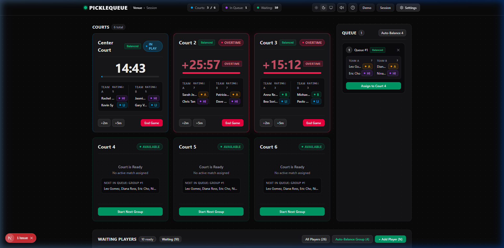
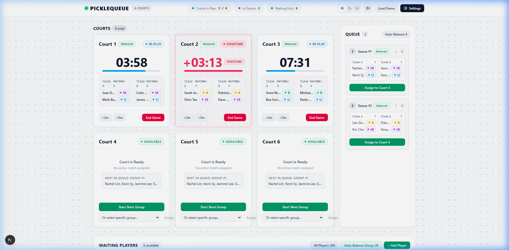
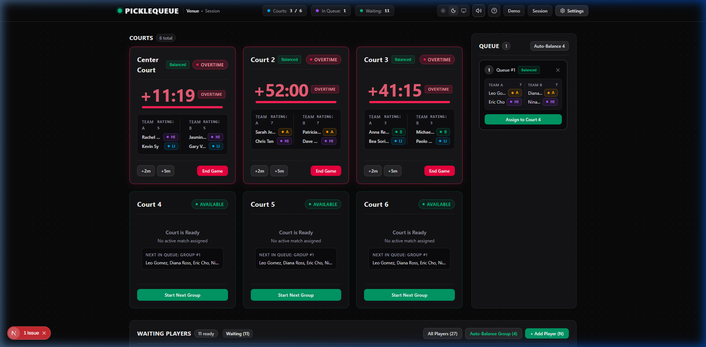
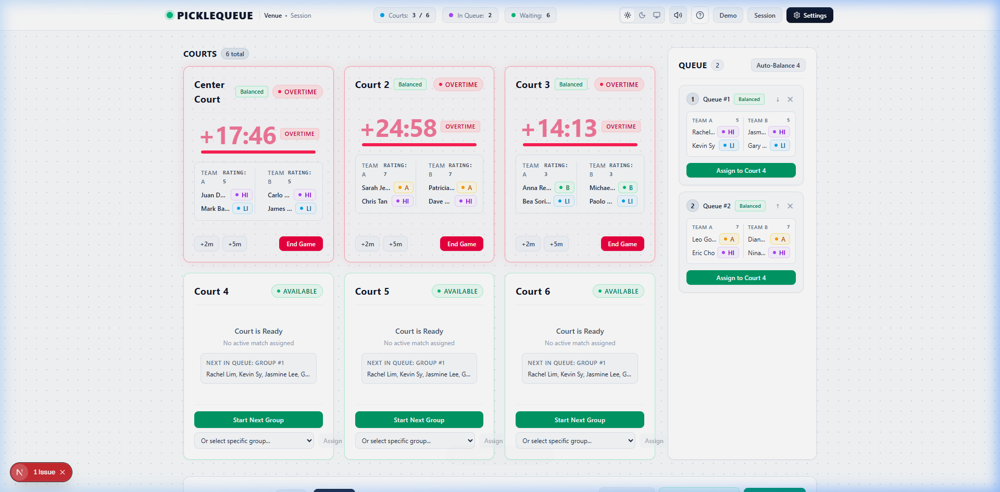

# PICKLEQUEUE

**Modern Pickleball Court Queuing, Rotation & Operations Dashboard**

[](https://github.com/dev-reymark/picklequeue/actions/workflows/ci.yml)
[](https://github.com/dev-reymark/picklequeue/releases)
[](LICENSE)

PICKLEQUEUE is a venue-first operations console designed for pickleball venues, open-play rotations, and tournament organizers. It handles player registration, 2v2 doubles skill balancing, FIFO court queues, drift-free match countdown timers, and event-based venue sound notifications.

---

## Screenshots

### Dark Mode Operations Console


### Light Mode (Tuned 1px Pin-Dot Grid)


### Sound Profiles & Milestone Alerts


### Multi-Tab Court & Venue Settings


---

## Live Deployments

- **Interactive Web App**: [https://picklequeue-ten.vercel.app/](https://picklequeue-ten.vercel.app/)
- **Documentation Portal**: [https://dev-reymark.github.io/picklequeue/](https://dev-reymark.github.io/picklequeue/)

---

## Core Features

- **Venue-Centric Console**: 70% court overview visible across the facility, paired with a dedicated queue sidebar and docked waiting pool.
- **Drift-Free Timers**: Timers use absolute system timestamps (`endsAt - Date.now()`) to prevent timing drift across page refreshes, tab switching, or device sleep.
- **Procedural Sound Suite**: Web Audio API synthesizer with zero external MP3 downloads, milestone alert guards, and venue sound profiles (`Minimal`, `Standard`, `Silent`).
- **Matchmaking & Auto-Balance**: Computes the optimal 2v2 team permutations from waiting players to balance skill ratings.
- **Post-Match Rotation Engine**: Workflows to Return to Waiting Pool, Requeue, Mark as Resting, or Check Out.
- **Component-Driven UI System**: Type-safe primitive components under `src/components/ui/` with consistent cursor states and focus rings.
- **Strictly Zero Emojis**: High-contrast, clean typography and semantic status dots instead of playful emojis.
- **Local Persistence & Backup**: Persistent state in `localStorage` (`picklequeue-state`) with full JSON backup export and import.
- **Light, Dark, and System Themes**: High-contrast themes powered by `next-themes` with a subtle light mode pin-dot grid.

---

## Tech Stack

- **Framework**: Next.js 16 (App Router, Turbopack)
- **Language**: TypeScript 5 (Strict Mode)
- **Styling**: Tailwind CSS v4, custom CSS variables, and dot-matrix background pattern
- **State Management**: Zustand 5 with `persist` middleware
- **Theming**: `next-themes` (Light / Dark / System)
- **Audio Engine**: Web Audio API (Procedural Oscillators & Envelopes)
- **Icons**: Lucide React (Minimal, functional set)

---

## Getting Started

### Prerequisites
- Node.js 18.18 or later
- npm or yarn

### Installation
```bash
git clone https://github.com/dev-reymark/picklequeue.git
cd picklequeue
npm install
```

### Running the Development Server
```bash
npm run dev
```
Open [http://localhost:3000](http://localhost:3000) in your web browser.

### Building for Production
```bash
npm run build
npm run start
```

---

## Project Structure

```text
picklequeue/
├── .github/
│   ├── ISSUE_TEMPLATE/       # Bug report & feature request templates
│   ├── pull_request_template.md
│   └── workflows/
│       └── ci.yml            # GitHub Actions CI build & typecheck
├── docs/
│   ├── architecture.md       # Technical architecture specification
│   ├── queue-system.md       # Matchmaking & rotation logic documentation
│   └── screenshots/          # High-resolution dashboard screenshots
├── src/
│   ├── app/
│   │   ├── globals.css       # Global styles, cursor rules, pin-dot grid
│   │   ├── layout.tsx        # Root layout with ThemeProvider
│   │   └── page.tsx          # Main operational dashboard
│   ├── components/
│   │   ├── courts/           # Court cards, grids, and end-game dialogs
│   │   ├── layout/           # Header, metrics bar, and theme controls
│   │   ├── players/          # Waiting pool and player check-in
│   │   ├── queue/            # FIFO queue panel and reorder controls
│   │   ├── session/          # End session modal and metrics
│   │   ├── settings/         # Multi-tab operational settings console
│   │   ├── tutorial/         # 5-step spotlight onboarding tour
│   │   └── ui/               # Reusable UI design system
│   ├── hooks/
│   │   ├── use-game-timer.ts # Drift-free countdown and milestone triggers
│   │   └── useSound.ts       # Centralized audio hook with profile filtering
│   ├── lib/
│   │   ├── matchmaking.ts    # 2v2 skill balancing algorithm
│   │   └── sound.ts          # Web Audio API procedural synthesizer
│   ├── store/
│   │   └── pickleball-store.ts # Zustand persistent state store
│   └── types/
│       └── index.ts          # TypeScript interfaces and domain models
├── CHANGELOG.md              # Semantic release notes
├── CONTRIBUTING.md           # Contribution guidelines
├── LICENSE                   # MIT License
└── package.json
```

---

## Documentation

- [Architecture Specification](docs/architecture.md)
- [Queue & Rotation Logic](docs/queue-system.md)
- [Release Changelog](CHANGELOG.md)
- [Contributing Guidelines](CONTRIBUTING.md)

---

## Product Roadmap

- [x] Drift-free match countdown timers & overtime tracking
- [x] Waiting pool with 1-click Auto-Balance (4 players)
- [x] FIFO & skill-balanced staging queue
- [x] Multi-tab operational settings with custom court naming
- [x] Event-driven Web Audio sound suite & sound profiles
- [x] Light / Dark / System themes with 1px pin-dot grid
- [x] First-run 5-step onboarding tutorial
- [x] JSON backup export and restore
- [ ] Multi-court TV kiosk display mode
- [ ] Multi-device real-time sync (Supabase / WebSockets)
- [ ] Tournament bracket generator (Single & Double Elimination)
- [ ] Player check-in via QR code / mobile self-service

---

## License

This project is licensed under the [MIT License](LICENSE).
