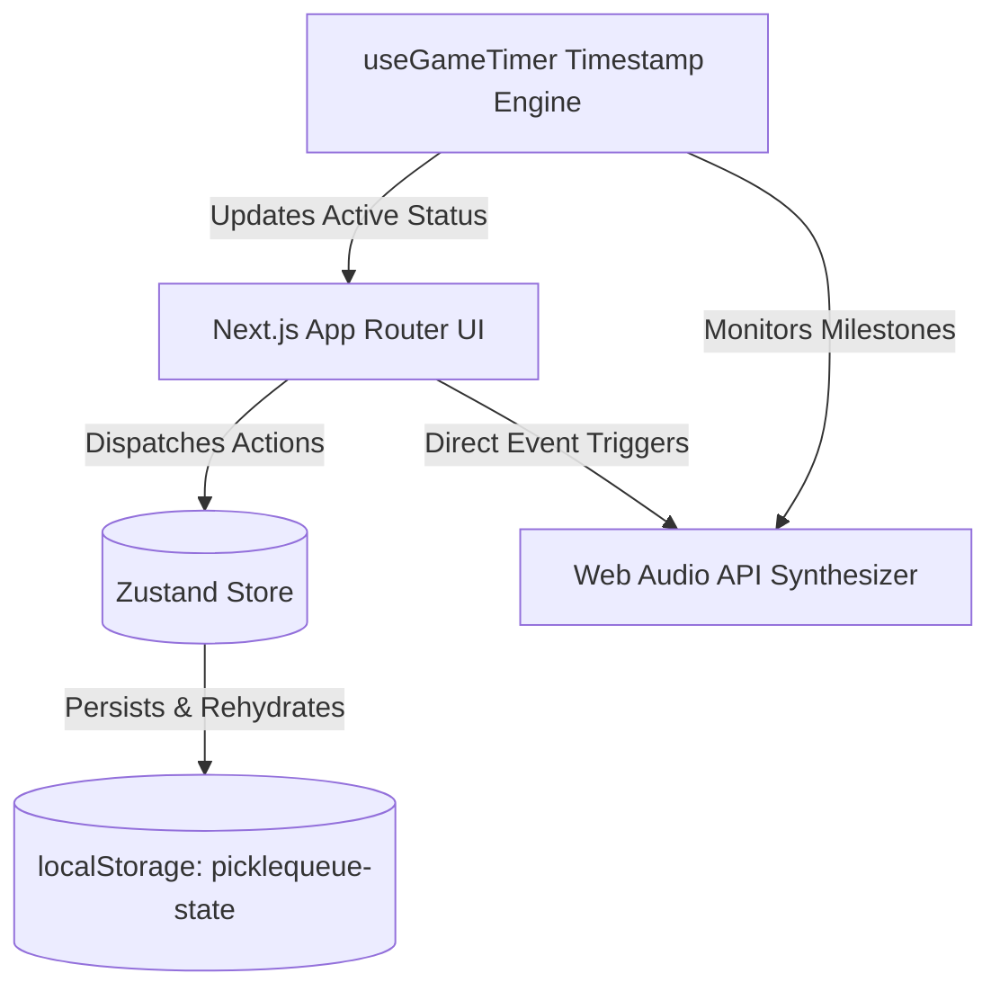

# Technical Architecture

This document provides a technical overview of **PICKLEQUEUE**, detailing its frontend structure, domain models, state management, timer calculation, and procedural audio engine.

---

## 1. System Overview

PICKLEQUEUE is an offline-capable, real-time court rotation dashboard designed for venue organizers and tournament directors.



---

## 2. Frontend Architecture

- **Framework**: Next.js 16 (App Router)
- **Styling**: Tailwind CSS v4 with custom CSS variables and responsive breakpoints.
- **Iconography**: Minimal Lucide React icons, adhering strictly to a **zero emojis** policy.
- **Component Primitives** (`src/components/ui/`):
  - `Button.tsx`: Standardized variants (primary, secondary, outline, ghost, danger, amber).
  - `Badge.tsx`: Status indicators with indicator dots.
  - `Input.tsx`, `Select.tsx`: Consistent form controls with emerald focus rings.
  - `Modal.tsx`: Accessible dialog with backdrop blur and escape key listener.
  - `Switch.tsx`: Toggle control for operational settings.
  - `Card.tsx`: Composable container cards.
  - `Tooltip.tsx`: Accessible hover tooltips.

---

## 3. Domain Model & State Management

State is managed by a single Zustand store with `persist` middleware (`picklequeue-state`):

| Domain | Key Data | Purpose |
| --- | --- | --- |
| **Players** | `id`, `name`, `skillLevel`, `rating`, `status`, `gamesPlayed` | Tracking player roster and availability |
| **Courts** | `id`, `name`, `status`, `currentMatch`, `timer` | Court allocation, countdowns, and overtime |
| **Queue** | `id`, `players`, `teamA`, `teamB`, `matchQuality`, `createdAt` | FIFO & skill-balanced match staging |
| **Games** | `id`, `courtId`, `players`, `startedAt`, `endedAt`, `durationSeconds` | Match history logs and session analytics |
| **Session** | `id`, `venueName`, `sessionName`, `startedAt`, `endedAt` | Current open rotation session metrics |
| **Settings** | `venueName`, `courtCount`, `gameDuration`, `soundProfile`, etc. | Venue configuration and sound controls |

---

## 4. Drift-Free Timers

Timers avoid `setInterval` counter accumulation (which drifts when tabs throttle background timers). Instead, each match stores an absolute timestamp:

```ts
// Match start:
const startedAt = Date.now();
const endsAt = startedAt + durationMinutes * 60 * 1000;

// On every tick (1000ms):
const remainingSeconds = Math.max(0, Math.floor((endsAt - Date.now()) / 1000));
const overtimeSeconds = Date.now() > endsAt ? Math.floor((Date.now() - endsAt) / 1000) : 0;
```

Persistent `useRef` flags (`warning2m`, `warning30s`, `timeUp`) ensure audio alerts fire **strictly once** when crossing milestones.

---

## 5. Procedural Audio Engine

Audio is generated programmatically via the **Web Audio API**:
- No external MP3 assets to load or fail.
- Works offline in all modern browsers.
- Custom gain envelopes and dual-oscillator chords for pleasing venue notifications.
- Filtered through configurable **Sound Profiles**:
  - `Minimal`: Only timers and court assignments.
  - `Standard`: All events including UI clicks.
  - `Silent`: Completely muted.
