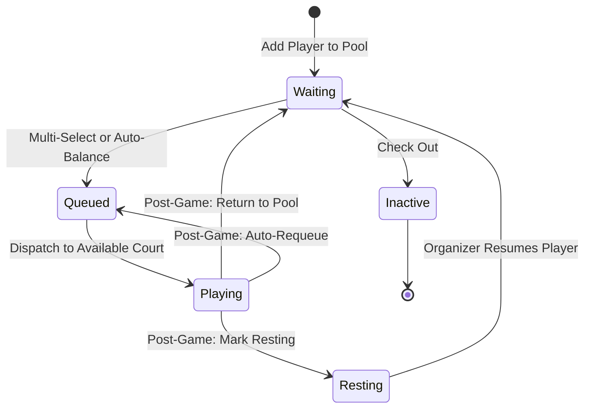

# Queue & Rotation System

This document outlines the queuing mechanics, player state machine, matchmaking algorithms, and post-game rotation workflows in **PICKLEQUEUE**.

---

## 1. Player Lifecycle State Machine



---

## 2. Matchmaking & Team Balancing Algorithm

When 4 players are selected (or generated via **Auto-Balance 4**), the system evaluates all 3 possible doubles permutations:
1. `[P0, P1]` vs `[P2, P3]`
2. `[P0, P2]` vs `[P1, P3]`
3. `[P0, P3]` vs `[P1, P2]`

Each player has a numeric skill rating:
- **Beginner**: 1.5
- **Intermediate**: 3.25
- **Advanced**: 4.25
- **Pro**: 5.0

The algorithm minimizes skill differential:
```ts
differential = Math.abs((rating[A0] + rating[A1]) - (rating[B0] + rating[B1]));
qualityScore = Math.max(0, 100 - (differential * 25));
```
The permutation with the lowest differential is assigned to **Team A** and **Team B**, displaying a balance quality badge (e.g., `95% Balanced`).

---

## 3. Post-Game Rotation Workflows

When an organizer concludes a match on a court, the **Post-Game Rotation Dialog** presents four options:

1. **Return to Waiting Pool** (Default)
   - Players are set to `waiting`.
   - Players become immediately eligible for new team groupings.
2. **Add to End of Queue**
   - Keeps the 4-player group intact.
   - Places the exact group at the end of the staging queue.
3. **Mark as Resting**
   - Sets player status to `resting`.
   - Protects tired players from being immediately grouped into consecutive matches.
4. **Check Out / Inactive**
   - Marks players as `inactive`.
   - Retains their game statistics and match history for the session while freeing court slots.
